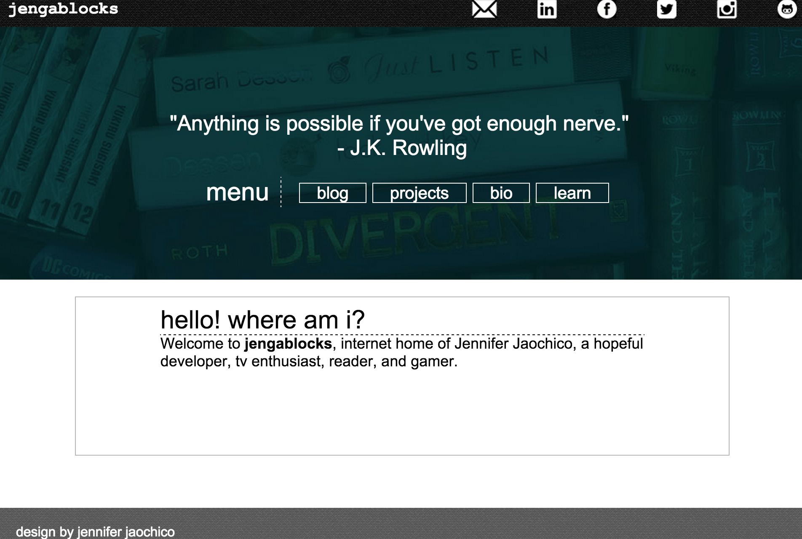

# jengablocks
*Jengablocks* was a technical and cultural blog created for DevBootcamp's Phase 0. During week 2, students were asked to practice HTML/CSS by creating a blog. When a student would complete an assigned post, students would advertise each post on Twitter. Instructors and other students would comment about these posts through twitter replies.

After the end of Phase 0 (9 weeks), students began learning onsite for Phase 1. No further additions have been made to the blog since. 

##### Dates Worked On
 April 11, 2015 - May 17, 2015

#### Landing Page


##### Technologies
```
* HTML5
* CSS3
```
